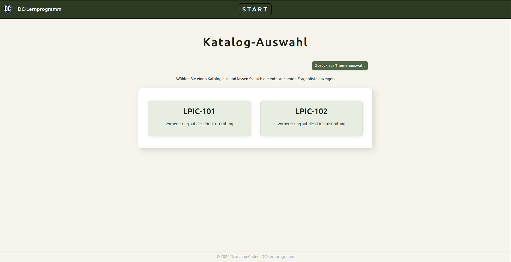
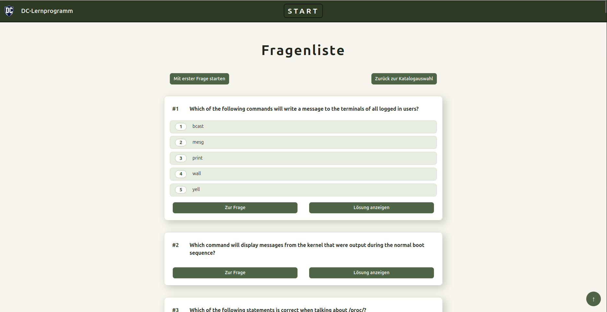
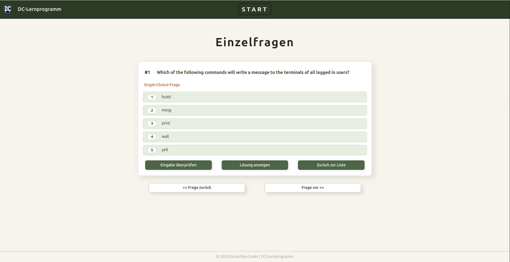

<h1>DC-Lernanwendung</h1>

Die DC-Lernanwendung ist eine Webanwendung zur Vorbereitung der Umschüler der BITLC GmbH auf die LPIC-1-Prüfungen. Sie kann außerdem zum Lernen weiterer spezifischer Themen verwendet werden. Die Anwendung wurde mit Angular 22 im Frontend und einer ASP.NET Core Minimal API im Backend entwickelt.

<h2>Screenshots</h2>

<h2>Verwendete Technologien</h2>

<h3>Frontend</h3>
<ul>
   <li>Angular 22</li>
   <li>HTML</li>
   <li>CSS</li>
</ul>
<h3>Backend</h3>
   <ul>
        <li>APS.NET Core 10 für Minimal API</li>
   </ul>
<h2>Systemvoraussetzungen</h2>

Vor dem Start muss folgende Software installert sein:

<ul>
<li>.NET SDK 10.0</li>
<li>Node.js 24</li>
<li>AngularCLI</li>
</ul>

<h2>Projektstruktur</h2>

Das Projekt besteht aus zwei Hauptverzeichnissen:

<ul>
<li>Lern-App: Angular-Frontend</li>
<li>web-api: ASP.NET-Core-Backend</li>
</ul>

<h2>Anleitung</h2>

<ol>
    <li>Backend starten (Minimal API):
        <ol>
            <li>Navigieren Sie in das Verzeichnis web-api</li>
            <li>Befehl ausführen: <b><i>dotnet run</i></b></li>
        </ol>
    </li>
    <li>Angular-Bibliotheken in die Anwendung installieren:
        <ol>
            <li>Navigieren Sie in das Angular-App-Verzeichnis (Lern-App)</li>
            <li>Befehl ausführen: <b><i>npm install</i></b></li>
        </ol>
    </li>
    <li>
        Frontend starten (Angular-App)
        <ol>
            <li>Navigieren Sie in das Verzeichnis Lern-App</li>
            <li>Befehl ausführen: <b><i>ng serve</i></b></li>
        </ol>
    </li>
    <li>
        Nutzung der DC-Lernanwendung
        <ol>
            <li>Browser öffnen</li>
            <li>In Adresszeile eingeben: http://localhost:4200</li>
        </ol>
    </li>

Viel Spaß mit der DC-Lernanwendung!

